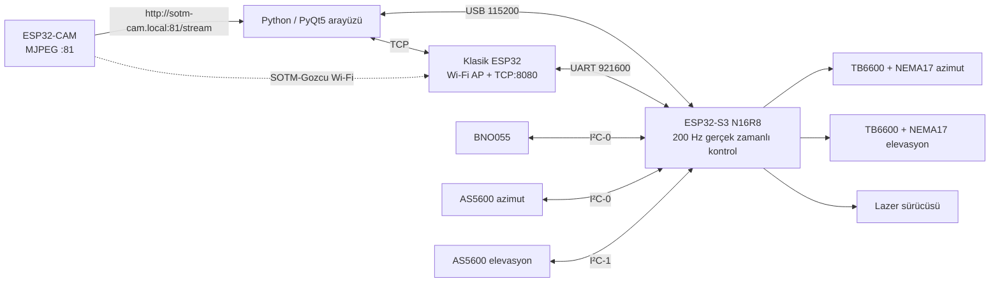

# SOTM-Gözcü — ESP32 Hareketli Uydu Terminali

Bu depo, STM32 kullanmadan hazırlanmış iki eksenli SOTM (Satellite on the
Move / hareketli uydu terminali) kontrol sistemidir. Teslim edilen sistem üç
ESP32 kartını birlikte kullanır:

- **ESP32-S3 N16R8:** 200 Hz sensör ve motor kontrolü, PID, güvenlik ve kalıcı
  ayarlar.
- **Klasik ESP32:** `SOTM-Gozcu` erişim noktası ve TCP–UART köprüsü.
- **ESP32-CAM:** hedef/lazer görüntüsünü MJPEG olarak Python arayüzüne aktarır.
- **Python/PyQt5 arayüzü:** USB veya Wi-Fi bağlantısı, telemetri, manuel ve
  otomatik mod, uydu bakış açısı hesabı, PID ayarı ve kamera düzeltmesi.

Malzeme listesindeki STM32F407 bu mimaride kullanılmaz. BNO055, iki AS5600,
iki NEMA17, iki TB6600, lazer, ESP32-S3, klasik ESP32 ve ESP32-CAM sisteme
dahil edilmiştir.

> **Önemli:** Yazılım derlenmiş ve otomatik olarak test edilmiştir; motor yönü,
> dişli oranı, mekanik sıfır, IMU eksen işaretleri, kamera görüş açısı ve PID
> değerleri ancak gerçek mekanizma üzerinde doğrulanabilir. İlk çalıştırmayı
> anten/lazer sökülmüşken veya güvenli alana çevrilmişken yapın.

## Sistem mimarisi



İki AS5600’nin sabit I²C adresi aynıdır (`0x36`). Bu yüzden azimut enkoderi
BNO055 ile I²C-0 üzerinde, elevasyon enkoderi ise ESP32-S3’ün ikinci I²C
denetleyicisinde çalışır. Bir TCA9548A çoklayıcı gerekli değildir.

## Dizinler

| Yol | İçerik |
|---|---|
| `firmware/src/controller` | ESP32-S3 sensör, PID, motor ve güvenlik kontrolü |
| `firmware/src/bridge` | Klasik ESP32 Wi-Fi/TCP–UART köprüsü |
| `firmware/src/camera` | AI-Thinker ESP32-CAM MJPEG sunucusu |
| `firmware/include/sotm_config.h` | Pinler, yönler, limitler, hızlar ve varsayılan PID |
| `firmware/PROTOCOL.md` | USB/TCP satır tabanlı JSON protokolü |
| `SOTM_Arayüz` | PyQt5 masaüstü arayüzü, kamera işleme ve testler |
| `TEST_RAPORU.md` | Temiz derleme, otomatik test ve kalan donanım testleri |

## Elektriksel bağlantılar

### ESP32-S3 denetleyici

| İşlev | ESP32-S3 GPIO | Karşı uç |
|---|---:|---|
| Azimut STEP / DIR / ENABLE | 4 / 5 / 6 | Azimut TB6600 arayüzü |
| Elevasyon STEP / DIR / ENABLE | 7 / 15 / 16 | Elevasyon TB6600 arayüzü |
| I²C-0 SDA / SCL | 8 / 9 | BNO055 + azimut AS5600 |
| I²C-1 SDA / SCL | 10 / 11 | Elevasyon AS5600 |
| Lazer kapısı | 13 | MOSFET/transistör sürücü girişi |
| Sıfır butonu | 14 | Butonun diğer ucu GND |
| Köprü TX / RX | 17 / 18 | Klasik ESP32 RX16 / TX17 |
| Acil dur | 21 | Normalde kapalı kontak üzerinden GND |
| Elevasyon min/max limit | 1 / 2 | İsteğe bağlı, varsayılan olarak kapalı |
| Hazır / kalibrasyon / hata LED | 40 / 41 / 42 | Seri dirençli LED |

Tüm kontrol elektroniğinin GND hattı ortak olmalıdır. ESP32-S3’ün GPIO35,
GPIO36 ve GPIO37 uçları N16R8 kartın OPI PSRAM’i için ayrılmıştır; GPIO19/20
USB, GPIO0/3/45/46 ise açılış yapılandırma uçlarıdır ve bu tasarımda motor
çıkışı olarak kullanılmaz.

### Klasik ESP32 köprü

| Klasik ESP32 | ESP32-S3 |
|---|---|
| GPIO17 TX2 | GPIO18 RX |
| GPIO16 RX2 | GPIO17 TX |
| GND | GND |

Her iki UART ucu 3,3 V seviyesindedir. Köprü; SSID `SOTM-Gozcu`, parola
`Gozcu-2026!`, IP `192.168.4.1` ve TCP port `8080` ile çalışır. Üretim/saha
kullanımından önce parolayı `firmware/include/sotm_config.h` içinde değiştirin.

### AS5600 ve BNO055

- Sensörleri 3,3 V ile besleyin; kullandığınız modülün kart üzerindeki
  regülatör/pull-up yapısını ayrıca kontrol edin.
- BNO055 adresi `0x28`, AS5600 adresi `0x36` kabul edilmiştir.
- Her I²C veri yolunda SDA ve SCL için 3,3 V’a uygun pull-up bulunmalıdır.
- AS5600 eksenine **diametrik mıknatıs** merkezlenerek yerleştirilmelidir.
  Telemetri, mıknatıs algılanmadığında motoru güvenli duruma geçirir.
- BNO055, kaideye `X=ileri`, `Y=sağ`, `Z=yukarı` olacak biçimde rijit
  sabitlenmelidir. Kablolar hareket etmeyecek şekilde bağlanmalıdır.

### TB6600 için zorunlu arayüz

ESP32’nin 3,3 V GPIO’sunu TB6600 optokuplör girişlerine doğrudan bağlamayın.
Her `STEP`, `DIR` ve `ENABLE` sinyali için NPN açık-kollektör katı veya uygun
bir ULN2003A kanalı kullanın:

1. TB6600 `PUL+`, `DIR+`, `ENA+` uçlarını temiz 5 V lojik beslemeye bağlayın.
2. İlgili `-` ucunu NPN kollektörüne bağlayın.
3. NPN emitörünü ortak GND’ye bağlayın.
4. ESP32 GPIO ile NPN bazı arasına yaklaşık 1–2,2 kΩ direnç koyun.
5. İki TB6600 için toplam altı kanal gerekir.

Her iki TB6600’yi **1/8 mikrostep** (motor turu başına 1600 darbe) ayarlayın.
Akım DIP anahtarlarını NEMA17 motorun etiket/datasheet akımına göre seçin;
motor akımı bilinmeden sabit bir TB6600 akım değeri vermek güvenli değildir.
Motor ile çıkış ekseni 1:1 değilse, motor devri / eksen devri oranlarını
`kAzGearRatio` ve `kElGearRatio` alanlarına girin.
Firmware adım komutlarını 80–2000 Hz ile sınırlar ve FastAccelStepper üzerinde
3000 step/s² ivme rampası uygular; bu değeri gerçek yükte stall testiyle
doğrulayın.

### Lazer ve güç

- Lazer GPIO13’ten doğrudan beslenmez. Lazer modülünü logic-level MOSFET/NPN
  ve kendi uygun beslemesiyle anahtarlayın. GPIO13 yalnız kapı sinyalidir.
- Motorlar için tercihen 24 V, TB6600 ve motor değerlerine uygun güç kaynağı;
  kartlar için ayrı ve kararlı 5 V buck dönüştürücü kullanın. ESP32-CAM için
  anlık akımı karşılayabilen 5 V / 2 A kaliteli besleme önerilir.
- Motor beslemesine sigorta, ana şalter ve fiziksel acil dur ekleyin. Yazılım
  acil duru fiziksel güç kesmenin yerine geçmez.
- Listelenen 650 nm lazer Class IIIa sınıfındadır. Işına veya yansımalarına
  bakmayın, OD2+ uygun lazer gözlüğü kullanın ve test alanını sınırlandırın.
- Gerçek 0–360° sürekli azimut için mekanik limit olmamalı; güç/RF/kamera
  kabloları için uygun slip-ring veya döner bağlantı gerekir.

Malzeme listesinde bulunmayan fakat güvenli kurulum için gereken başlıca
parçalar: altı kanallı seviye sürücü, lazer MOSFET’i, NC acil dur, sıfır
butonu, tercihen iki elevasyon limit anahtarı, sigorta, buck dönüştürücü,
AS5600 mıknatısları ve sürekli azimut için slip-ring. Gerçek RF bağlantısı
isteniyorsa ayrıca 10–50 cm anten, LNB/BUC/modem ve ilgili RF zinciri gerekir.

## Yazılım kurulumu

Windows PowerShell’de depo kökünde:

```powershell
py -3 -m venv .venv
.\.venv\Scripts\python.exe -m pip install --upgrade pip
.\.venv\Scripts\python.exe -m pip install -r .\SOTM_Arayüz\requirements.txt
.\.venv\Scripts\python.exe -m pip install platformio==6.1.18
```

Python 3.10–3.12 önerilir. Bu çalışma alanında `.venv` hazırlanmıştır; başka
bir bilgisayara kopyalandığında sanal ortamı yeniden oluşturun.

## Firmware derleme ve yükleme

Üç hedefi birden derlemek:

```powershell
.\.venv\Scripts\python.exe -m platformio run --project-dir .\firmware
```

Kartları sırayla yüklemek:

```powershell
# ESP32-S3 N16R8
.\.venv\Scripts\python.exe -m platformio run --project-dir .\firmware `
  -e esp32-s3-controller -t upload --upload-port COM5

# Klasik ESP32
.\.venv\Scripts\python.exe -m platformio run --project-dir .\firmware `
  -e esp32-wifi-bridge -t upload --upload-port COM6

# AI-Thinker ESP32-CAM
.\.venv\Scripts\python.exe -m platformio run --project-dir .\firmware `
  -e esp32cam -t upload --upload-port COM7
```

COM numaralarını Windows Aygıt Yöneticisi’nden değiştirin. ESP32-CAM yükleme
sırasında USB–TTL dönüştürücü kullanın; `GPIO0` GND’ye çekiliyken resetleyip
yükleyin, sonra `GPIO0` bağlantısını kaldırıp yeniden resetleyin. USB–TTL
çıkışının 3,3 V lojik seviyeli olması gerekir.

Başarılı derleme çıktıları:

- `firmware/.pio/build/esp32-s3-controller/firmware.bin`
- `firmware/.pio/build/esp32-wifi-bridge/firmware.bin`
- `firmware/.pio/build/esp32cam/firmware.bin`

## İlk güvenli devreye alma

1. **Motor ve lazer beslemesini kapalı tutun.** Yalnız ESP32 ve sensörleri
   enerjilendirin.
2. GPIO21’e bağlı NC acil dur zincirinin normal durumda GND seviyesinde
   olduğunu doğrulayın. Açıkta bırakılırsa firmware kasıtlı olarak hata
   durumunda kalır.
3. USB seri monitörde veya GUI telemetrisinde `imu_ok`,
   `encoder_az_ok`, `encoder_el_ok` alanlarının `true` olduğunu kontrol edin.
4. Kaideyi hareket ettirerek roll/pitch/yaw işaretlerini doğrulayın. Sistem
   ters yönde düzeltme yapacaksa yalnız
   `kImuRollSign/kImuPitchSign/kImuYawSign` değerlerini değiştirin.
5. Mekaniği gerçek kuzeyi gösterecek `azimut=0°`, ufuk hizasındaki
   `elevasyon=0°` konumuna getirin. Manuel ve durmuş durumdayken sıfır
   butonunu 1,2 saniye basılı tutun. Değerler ESP32 NVS’ye kaydedilir.
6. Dişli oranlarını `kAzGearRatio/kElGearRatio` alanlarında doğrulayın. Motor
   beslemesini açın; önce 2–5° küçük manuel hareket verin. Yön tersse
   ilgili `kAzDirectionHighCountsUp`, `kElDirectionHighCountsUp`,
   `kAzEncoderReversed` veya `kElEncoderReversed` sabitini değiştirip yeniden
   derleyin.
7. BNO055’i sabit tutup yavaşça tüm yönlerde hareket ettirerek kalibre edin.
   Otomatik moda geçmek için `gyro >= 2` ve `accel >= 2` gerekir.
8. Kamera/lazer eksenlerini mekanik olarak çakıştırın. Gerekirse
   `SOTM_Arayüz/config.py` içindeki yatay/dikey FOV değerlerini ölçerek
   güncelleyin.
9. Ancak bu kontrollerden sonra lazeri ve gerçek anten yükünü takın.

Elevasyon limit anahtarları takıldığında
`kElevationLimitSwitchesEnabled=true` yapın. Yazılımsal elevasyon sınırı
0–90°, azimut hedefi 0–360°’dir; azimut kontrolü en kısa dönüş yönünü seçer.

## Python arayüzünü çalıştırma

```powershell
cd .\SOTM_Arayüz
..\.venv\Scripts\python.exe .\main.py
```

### USB ile

1. ESP32-S3’ü USB ile bağlayın.
2. Arayüzde **USB**, doğru COM portu ve `115200` baud seçin.
3. **Yeniden Bağlan** düğmesine basın.

### Wi-Fi ile

1. Bilgisayarı `SOTM-Gozcu` ağına bağlayın.
2. Arayüzde **Wi-Fi**, IP olarak `192.168.4.1` seçin.
3. **Yeniden Bağlan** düğmesine basın.
4. Kamera otomatik olarak
   `http://sotm-cam.local:81/stream` adresinden açılır. mDNS çalışmıyorsa
   ESP32-CAM’in DHCP adresini seri monitörden öğrenip aşağıdaki gibi başlatın:

```powershell
$env:SOTM_CAMERA_SOURCE="http://192.168.4.2:81/stream"
..\.venv\Scripts\python.exe .\main.py
```

USB kamera ile masaüstü denemesi için `SOTM_CAMERA_SOURCE=0` kullanılabilir.

## Kullanım akışı

1. Telemetri geldikten sonra **Manuel** modda küçük hareketlerle sistemi
   doğrulayın.
2. İstasyon enlem, boylam, yükseklik ve jeostasyoner uydu boylamını girin.
   Arayüz gerçek kuzeye göre azimut/elevasyon hesaplar.
3. **Uyduya Yönlendir** ile mekanizmayı hesaplanan konuma gönderin.
4. Hedefe ulaşıldıktan ve BNO055 kalibrasyonu yeterli olduktan sonra
   **Otomatik** moda geçin. ESP32-S3 o andaki dünya referanslı bakış vektörünü
   kilitler; roll, pitch ve yaw hareketlerinde anten hedefini korur.
5. Kamera lazer noktasını bulduğunda sınırlı açısal düzeltmeler gönderir.
   Düzeltme bir kerede en fazla Python’da 1,5°, firmware’de 2° ile sınırlıdır.
6. Herhangi bir anormallikte **Durdur** ve fiziksel acil duru kullanın.

PID tablosundaki **Uygula** geçici, **Kaydet** kalıcı NVS ayarıdır. Başlangıç
değerleri her iki eksen için `P=3.65`, `I=0.58`, `D=0.92`’dir. Gerçek
mekanizmada önce düşük hızda, küçük açı komutlarıyla ayar yapın.

## Donanımsız test ve otomatik doğrulama

GUI–protokol akışını gerçek kart olmadan denemek:

```powershell
# 1. terminal
cd .\SOTM_Arayüz
..\.venv\Scripts\python.exe .\sahte_sunucu.py

# 2. terminal
$env:SOTM_CAMERA_SOURCE="0"
..\.venv\Scripts\python.exe .\main.py
```

Arayüzde Wi-Fi IP’si olarak `127.0.0.1` kullanın.

Tüm Python testleri:

```powershell
cd .\SOTM_Arayüz
..\.venv\Scripts\python.exe -m pytest
```

GUI ile sahte ESP32-S3 arasında otomatik uçtan uca duman testi:

```powershell
..\.venv\Scripts\python.exe .\smoke_test_e2e.py
```

Testler; parçalanmış/birleşmiş TCP JSON paketlerini, iletişim kuyruğunu,
jeostasyoner uydu bakış hesabını, kamera açı dönüşümünü, OpenCV lazer
algılamasını, Kalman kayıp/tahmin davranışını ve hedef işlem hattını kapsar.

## Güvenlik davranışı

ESP32-S3 aşağıdaki hallerde motor çıkışlarını ve lazeri kapatıp hatayı
kilitler:

- NC acil dur zinciri açılırsa;
- IMU veya herhangi bir AS5600 art arda beş çevrim okunamazsa;
- AS5600 mıknatıs durumu geçersizse;
- etkin elevasyon limitlerinden hareket yönündeki anahtar tetiklenirse;
- motor darbe kanalı başlatılamazsa.

Bağlantının kesilmesi mevcut hareketi tek başına acil durdurmaz; gerçek zamanlı
stabilizasyon ESP32-S3 üzerinde bağımsız sürer. Yarışma/saha prosedürünüz
bağlantı kaybında durmayı gerektiriyorsa fiziksel operatör acil duru
kullanmalıdır. Hata giderildikten sonra protokoldeki `hata_temizle` komutu
verilebilir. Tüm mesaj biçimleri için `firmware/PROTOCOL.md` dosyasına bakın.

## Yarışma ve tasarım notları

Mimari, TEKNOFEST 2026 dokümanındaki manuel/otomatik kontrol, kablolu/kablosuz
arayüz, kalıcı parametre, 0–360° azimut, 0–90° elevasyon ve hareketli platform
stabilizasyon ihtiyaçlarını hedefler. Mekanik sistem; yarışmanın kütle, güç,
anten çapı, yeniden yönlenme süresi ve güvenlik sınırları açısından ayrıca
ölçülmelidir. Kodun derlenmesi bu fiziksel kabul kriterlerinin sağlandığı
anlamına gelmez.

Başvurulan birincil teknik kaynaklar:

- [TEKNOFEST Hareketli Uydu Terminali Yarışması](https://www.teknofest.org/tr/yarismalar/hareketli-uydu-terminali-yarismasi/)
- [2026 yarışma şartnamesi PDF](https://cdn.teknofest.org/media/upload/userFormUpload/Teknofest_Hareketli_Uydu_Terminali_Yar%C4%B1smas%C4%B1_Sartnamesi_TR_4d8Az.pdf)
- [ESP32-S3-DevKitC-1 donanım kılavuzu](https://docs.espressif.com/projects/esp-dev-kits/en/latest/esp32s3/esp32-s3-devkitc-1/user_guide_v1.1.html)
- [AS5600 veri sayfası](https://look.ams-osram.com/m/7059eac7531a86fd/original/AS5600-DS000365.pdf)
- [BNO055 veri sayfası](https://www.bosch-sensortec.com/media/boschsensortec/downloads/datasheets/bst-bno055-ds000.pdf)
- [FastAccelStepper kaynak deposu](https://github.com/gin66/FastAccelStepper)

Not: Bosch, BNO055’i yeni tasarımlar için önermemektedir; bu projede verilen
malzeme listesinde bulunduğu için kullanılmıştır. Yeni kart revizyonunda aktif
ürün bir IMU’ya geçiş planlanmalıdır.
